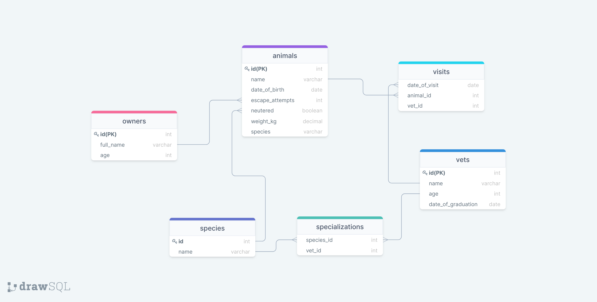

# Vet-Clinic-DataBase

> This database project contains files that creates a table, insert data into the table and queries the data in the table.

## Getting Started

This repository includes files with plain SQL that can be used to recreate a database:

- Use [schema.sql](./schema.sql) to create all tables.
- Use [data.sql](./data.sql) to populate tables with sample data.
- Check [queries.sql](./queries.sql) for examples of queries that can be run on a newly created database. **Important note: this file might include queries that make changes in the database (e.g., remove records). Use them responsibly!**

👤 **Fatima Zahir**

- GitHub: [@githubhandle](https://github.com/Fatima-hub333)
- Twitter: [@twitterhandle](https://twitter.com/Fatima_developr)
- LinkedIn: [LinkedIn](https://www.linkedin.com/in/fatimaa-zahir/)

👤 **Stanley Sunday**

- GitHub: [@idungstanley](https://github.com/idungstanley)
- Twitter: [@IdungStanley](https://twitter.com/IdungStanley)
- LinkedIn: [Stanley Idung Sunday](https://www.linkedin.com/in/sundaystanley56/)

## 🤝 Contributing

Contributions, issues, and feature requests are welcome!

Feel free to check the [issues page](https://github.com/Fatima-hub333/vet_clinic_database/issues).

## Show your support

Give a ⭐️ if you like this project!

## Acknowledgments

- Hat tip to anyone whose code was used
- Inspiration
- etc

## 📝 License

This project is [MIT](./MIT.md) licensed.
